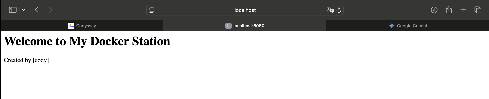
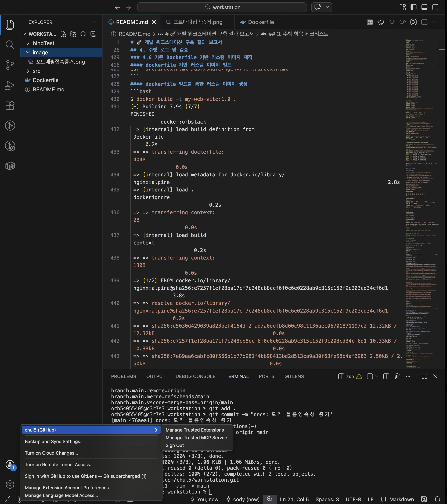

# 🚀 개발 워크스테이션 구축 결과 보고서

## 1. 프로젝트 개요
본 미션은 터미널, Docker, Git/GitHub을 활용하여 '내 컴퓨터에서만 돌아가는' 환경 문제를 방지하고, 팀원 누구나 동일한 방식으로 실행, 배포, 디버깅할 수 있는 **재현 가능한 개발 워크스테이션 구축**을 목표로 합니다. 리눅스 CLI 조작, 컨테이너 격리 원칙, 포트 매핑 및 데이터 영속성(Volume)의 핵심 흐름을 직접 검증하고 기록하였습니다.

### 1.1 프로젝트 디렉터리 구조
1. Dockerfile 및 docker-compose.yml: 인프라 명세서로 프로젝트 루트에 배치하여 즉시 빌드 가능한 환경 구축.
2. src/: 실제 서비스 코드를 격리하여 관리함으로써, 인프라 설정 변경이 소스 코드에 영향을 주지 않도록 구성.
3. bindTest/ 및 image/: 검증용 데이터와 문서화 자료를 별도 폴더로 관리하여 프로젝트의 순수성을 유지.
```
.
├── bindTest/          # 바인드 마운트 검증용 폴더
├── image/             # 프로젝트 실행 및 설정 증빙 스크린샷
├── src/               # 서비스 소스 코드 (index.html 등)
├── Dockerfile         # 컨테이너 빌드 스크립트
├── docker-compose.yml # docker-compose 스크립트
└── README.md          # 프로젝트 문서

```

## 2. 실행 환경
- **OS**: macOS (Apple Silicon)
- **Shell**: zsh
- **Terminal**: VSCode Terminal
- **Docker**: 28.5.2 (OrbStack 환경)
- **Git**: 2.53.0

## 3. 수행 항목 체크리스트
- [x] 터미널 조작 로그 기록
- [x] 파일 및 디렉토리 권한 변경 실습 (644/755/777)
- [x] Docker 설치 및 기본 환경 점검 (`docker info`)
- [x] Docker 기본 운영 명령 수행
- [x] Docker 컨테이너 실행 실습 (hello-world / ubuntu)
- [x] Dockerfile 기반 커스텀 웹 서버 이미지 제작
- [x] 포트 매핑 및 브라우저 접속 확인
- [x] Docker 볼륨을 이용한 데이터 영속성 검증
- [x] Git 사용자 설정 및 GitHub 원격 저장소 연동
- [ ] Bonus

---

## 4. 수행 로그 및 검증

### 4.1 터미널 조작 로그 기록
명령어 실행 후 `ls` 및 `pwd`를 통해 상태 변화를 검증하였습니다.

```bash
# 1. 현재 위치 확인 및 실습 디렉토리 생성
$ pwd
/Users/och54055405

$ mkdir -p ~/study/workStation/practice
$ ls -al ~/study  # 디렉토리 생성 확인
total 0
drwxr-xr-x   3 och54055405  och54055405   96 Apr  1 20:20 .
drwxr-x---+ 21 och54055405  och54055405  672 Apr  1 20:20 ..
drwxr-xr-x   3 och54055405  och54055405   96 Apr  1 20:20 workStation

# 2. 이동
$ cd ./study/workStation
$ pwd
/Users/och54055405/study/workStation

# 2. 파일 생성 및 내용 확인
$ touch mvTest
$ echo 'hello world' > hello
$ ls -al
total 8
drwxr-xr-x  5 och54055405  och54055405  160 Apr  1 20:22 .
drwxr-xr-x  3 och54055405  och54055405   96 Apr  1 20:20 ..
-rw-r--r--  1 och54055405  och54055405   12 Apr  1 20:22 hello
-rw-r--r--  1 och54055405  och54055405    0 Apr  1 20:22 mvTest
drwxr-xr-x  2 och54055405  och54055405   64 Apr  1 20:20 practice

$ cat hello 
hello world

# 3. 복사 및 이름 변경(이동) 검증
$ cp hello hello2
$ ls -al
total 16
drwxr-xr-x  6 och54055405  och54055405  192 Apr  1 20:23 .
drwxr-xr-x  3 och54055405  och54055405   96 Apr  1 20:20 ..
-rw-r--r--  1 och54055405  och54055405   12 Apr  1 20:22 hello
-rw-r--r--  1 och54055405  och54055405   12 Apr  1 20:23 hello2
-rw-r--r--  1 och54055405  och54055405    0 Apr  1 20:22 mvTest
drwxr-xr-x  2 och54055405  och54055405   64 Apr  1 20:20 practice

$ mv hello hello1
$ ls -al
total 16
drwxr-xr-x  6 och54055405  och54055405  192 Apr  1 20:23 .
drwxr-xr-x  3 och54055405  och54055405   96 Apr  1 20:20 ..
-rw-r--r--  1 och54055405  och54055405   12 Apr  1 20:22 hello1
-rw-r--r--  1 och54055405  och54055405   12 Apr  1 20:23 hello2
-rw-r--r--  1 och54055405  och54055405    0 Apr  1 20:22 mvTest
drwxr-xr-x  2 och54055405  och54055405   64 Apr  1 20:20 practice

$ mv hello2 practice/
$ ls -al practice/            # 파일 이동 확인
total 8
drwxr-xr-x  3 och54055405  och54055405   96 Apr  1 20:23 .
drwxr-xr-x  5 och54055405  och54055405  160 Apr  1 20:23 ..
-rw-r--r--  1 och54055405  och54055405   12 Apr  1 20:23 hello2

# 4. 삭제 검증
$ rm ./practice/hello2
$ ls -al practice/
total 0
drwxr-xr-x  2 och54055405  och54055405   64 Apr  1 20:24 .
drwxr-xr-x  5 och54055405  och54055405  160 Apr  1 20:23 ..

```
### 4.2 권한실습 및 증거기록
- r(4), w(2), x(1)의 합으로 표기함.
- 755: 소유자(rwx=7), 그룹/기타(rx=5). 실행 파일이나 디렉터리에 주로 사용.
- 644: 소유자(rw=6), 그룹/기타(r=4). 일반 텍스트 파일에 주로 사용.
```bash
# 1. 파일 변경 전 권한
$ ls -al hello1
-rw-r--r--  1 och54055405  och54055405  12 Apr  1 20:22 hello1

# 2. 파일 변경 후 권한
$ chmod 755 hello1 # 소유자는 풀권한, 그룹과 다른 사용자는 읽고 실행할 수 있는 권한만
$ ls -al hello1
-rwxr-xr-x  1 och54055405  och54055405  12 Apr  1 20:22 hello1

# 3. 디렉터리 변경 전 권한
$ ls -al 
total 8
drwxr-xr-x  5 och54055405  och54055405  160 Apr  1 20:23 .
drwxr-xr-x  3 och54055405  och54055405   96 Apr  1 20:20 ..
-rwxr-xr-x  1 och54055405  och54055405   12 Apr  1 20:22 hello1
-rw-r--r--  1 och54055405  och54055405    0 Apr  1 20:22 mvTest
drwxr-xr-x  2 och54055405  och54055405   64 Apr  1 20:24 practice

# 4. 디렉터리 변경 후 권한
$ chmod 777 practice # 공용 디렉터리로서 모든 사용자의 쓰기 권한이 필요한 경우
$ ls -al 
drwxr-xr-x  5 och54055405  och54055405  160 Apr  1 20:23 .
drwxr-xr-x  3 och54055405  och54055405   96 Apr  1 20:20 ..
-rwxr-xr-x  1 och54055405  och54055405   12 Apr  1 20:22 hello1
-rw-r--r--  1 och54055405  och54055405    0 Apr  1 20:22 mvTest
drwxrwxrwx  2 och54055405  och54055405   64 Apr  1 20:24 practice

```
### 4.3 Docker 설치 및 기본 점검
```bash
# 1. docker version
$ docker --version
Docker version 28.5.2, build ecc6942

# 2. docker 데몬 동작 여부 확인 결과
$ docker info
Client:
 Version:    28.5.2
 Context:    orbstack
 Debug Mode: false
 Plugins:
  buildx: Docker Buildx (Docker Inc.)
    Version:  v0.29.1
    Path:     /Users/och54055405/.docker/cli-plugins/docker-buildx
  compose: Docker Compose (Docker Inc.)
    Version:  v2.40.3
    Path:     /Users/och54055405/.docker/cli-plugins/docker-compose

Server:
 Containers: 0 # 현재 내 피씨에 있는 컨테이너 갯수
  Running: 0
  Paused: 0
  Stopped: 0
 Images: 0 # 내려받은 이미지 갯수
 Server Version: 28.5.2
 Storage Driver: overlay2
  Backing Filesystem: btrfs
  Supports d_type: true
  Using metacopy: false
  Native Overlay Diff: true
  userxattr: false
 Logging Driver: json-file
 Cgroup Driver: cgroupfs
 Cgroup Version: 2
 Plugins:
  Volume: local
  Network: bridge host ipvlan macvlan null overlay
  Log: awslogs fluentd gcplogs gelf journald json-file local splunk syslog
 CDI spec directories:
  /etc/cdi
  /var/run/cdi
 Swarm: inactive
 Runtimes: io.containerd.runc.v2 runc
 Default Runtime: runc
 Init Binary: docker-init
 containerd version: 1c4457e00facac03ce1d75f7b6777a7a851e5c41
 runc version: d842d7719497cc3b774fd71620278ac9e17710e0
 init version: de40ad0
 Security Options:
  seccomp
   Profile: builtin
  cgroupns
 Kernel Version: 6.17.8-orbstack-00308-g8f9c941121b1
 Operating System: OrbStack # 컨테이너를 실행하고 관리할 수 있도록 지원하는 주체
 OSType: linux
 Architecture: x86_64
 CPUs: 6
 Total Memory: 15.67GiB
 Name: orbstack
 ID: 7b7c0e86-79c4-4f60-b427-e9ec47343774
 Docker Root Dir: /var/lib/docker
 Debug Mode: false
 Experimental: false
 Insecure Registries:
  ::1/128
  127.0.0.0/8
 Live Restore Enabled: false
 Product License: Community Engine
 Default Address Pools:
   Base: 192.168.97.0/24, Size: 24
   Base: 192.168.107.0/24, Size: 24
   Base: 192.168.117.0/24, Size: 24
   Base: 192.168.147.0/24, Size: 24
   Base: 192.168.148.0/24, Size: 24
   Base: 192.168.155.0/24, Size: 24
   Base: 192.168.156.0/24, Size: 24
   Base: 192.168.158.0/24, Size: 24
   Base: 192.168.163.0/24, Size: 24
   Base: 192.168.164.0/24, Size: 24
   Base: 192.168.165.0/24, Size: 24
   Base: 192.168.166.0/24, Size: 24
   Base: 192.168.167.0/24, Size: 24
   Base: 192.168.171.0/24, Size: 24
   Base: 192.168.172.0/24, Size: 24
   Base: 192.168.181.0/24, Size: 24
   Base: 192.168.183.0/24, Size: 24
   Base: 192.168.186.0/24, Size: 24
   Base: 192.168.207.0/24, Size: 24
   Base: 192.168.214.0/24, Size: 24
   Base: 192.168.215.0/24, Size: 24
   Base: 192.168.216.0/24, Size: 24
   Base: 192.168.223.0/24, Size: 24
   Base: 192.168.227.0/24, Size: 24
   Base: 192.168.228.0/24, Size: 24
   Base: 192.168.229.0/24, Size: 24
   Base: 192.168.237.0/24, Size: 24
   Base: 192.168.239.0/24, Size: 24
   Base: 192.168.242.0/24, Size: 24
   Base: 192.168.247.0/24, Size: 24
   Base: fd07:b51a:cc66:d000::/56, Size: 64

WARNING: DOCKER_INSECURE_NO_IPTABLES_RAW is set
```
### 4.4 Docker 기본 운영 명령 수행
- 이미지 vs 컨테이너 차이
   - 이미지(Image): 서비스 실행에 필요한 모든 파일과 설정을 압축한 '불변의 설계도(Read-Only)'.
   - 컨테이너(Container): 이미지를 실행한 '격리된 프로세스'. 컨테이너에서 변경된 사항은 이미지에 영향을 주지 않음.
- docker는 왜 쓸까?
   - "내 컴퓨터에선 되는데 서버에선 왜 안 되지?" 상황을 방지하기 위해서

```bash
# 1. docker pull
$ docker pull nginx
Using default tag: latest
latest: Pulling from library/nginx
ec781dee3f47: Pull complete 
bb3d0aa29654: Pull complete 
510ddf6557d6: Pull complete 
cde7a05ae428: Pull complete 
587e3d84dbb5: Pull complete 
3189680c601f: Pull complete 
5e815e07e569: Pull complete 
Digest: sha256:7150b3a39203cb5bee612ff4a9d18774f8c7caf6399d6e8985e97e28eb751c18
Status: Downloaded newer image for nginx:latest
docker.io/library/nginx:latest

# 2. docker images
$ docker images
REPOSITORY   TAG       IMAGE ID       CREATED      SIZE
nginx        latest    0cf1d6af5ca7   7 days ago   161MB

# 3. docker run (이미지를 실행시켜 격리된 공간을 만듦)
$ docker run hello-world
Unable to find image 'hello-world:latest' locally
latest: Pulling from library/hello-world
4f55086f7dd0: Pull complete 
Digest: sha256:452a468a4bf985040037cb6d5392410206e47db9bf5b7278d281f94d1c2d0931
Status: Downloaded newer image for hello-world:latest

Hello from Docker!
This message shows that your installation appears to be working correctly.

To generate this message, Docker took the following steps:
 1. The Docker client contacted the Docker daemon.
 2. The Docker daemon pulled the "hello-world" image from the Docker Hub.
    (amd64)
 3. The Docker daemon created a new container from that image which runs the
    executable that produces the output you are currently reading.
 4. The Docker daemon streamed that output to the Docker client, which sent it
    to your terminal.

To try something more ambitious, you can run an Ubuntu container with:
 $ docker run -it ubuntu bash

Share images, automate workflows, and more with a free Docker ID:
 https://hub.docker.com/

For more examples and ideas, visit:
 https://docs.docker.com/get-started/

# 4. docker ps
$ docker ps
CONTAINER ID   IMAGE     COMMAND   CREATED   STATUS    PORTS     NAMES
$ docker ps -a
CONTAINER ID   IMAGE         COMMAND    CREATED          STATUS                      PORTS     NAMES
aa299f003f00   hello-world   "/hello"   10 minutes ago   Exited (0) 10 minutes ago             keen_black

# 5. docker logs 
$ docker run -d --name my-web nginx
0c269420e2e59087f0984a1043060f8d855497e1fe275a5d191564d5d48bf085

$ docker logs my-web
/docker-entrypoint.sh: /docker-entrypoint.d/ is not empty, will attempt to perform configuration
/docker-entrypoint.sh: Looking for shell scripts in /docker-entrypoint.d/
/docker-entrypoint.sh: Launching /docker-entrypoint.d/10-listen-on-ipv6-by-default.sh
10-listen-on-ipv6-by-default.sh: info: Getting the checksum of /etc/nginx/conf.d/default.conf
10-listen-on-ipv6-by-default.sh: info: Enabled listen on IPv6 in /etc/nginx/conf.d/default.conf
/docker-entrypoint.sh: Sourcing /docker-entrypoint.d/15-local-resolvers.envsh
/docker-entrypoint.sh: Launching /docker-entrypoint.d/20-envsubst-on-templates.sh
/docker-entrypoint.sh: Launching /docker-entrypoint.d/30-tune-worker-processes.sh
/docker-entrypoint.sh: Configuration complete; ready for start up
2026/04/01 12:14:29 [notice] 1#1: using the "epoll" event method
2026/04/01 12:14:29 [notice] 1#1: nginx/1.29.7
2026/04/01 12:14:29 [notice] 1#1: built by gcc 14.2.0 (Debian 14.2.0-19) 
2026/04/01 12:14:29 [notice] 1#1: OS: Linux 6.17.8-orbstack-00308-g8f9c941121b1
2026/04/01 12:14:29 [notice] 1#1: getrlimit(RLIMIT_NOFILE): 20480:1048576
2026/04/01 12:14:29 [notice] 1#1: start worker processes
2026/04/01 12:14:29 [notice] 1#1: start worker process 29
2026/04/01 12:14:29 [notice] 1#1: start worker process 30
2026/04/01 12:14:29 [notice] 1#1: start worker process 31
2026/04/01 12:14:29 [notice] 1#1: start worker process 32
2026/04/01 12:14:29 [notice] 1#1: start worker process 33
2026/04/01 12:14:29 [notice] 1#1: start worker process 34

# 6. docker stats
$ docker stats --no-stream my-web
CONTAINER ID   NAME      CPU %     MEM USAGE / LIMIT     MEM %     NET I/O         BLOCK I/O         PIDS
0c269420e2e5   my-web    0.00%     6.199MiB / 15.67GiB   0.04%     1.13kB / 126B   16.9MB / 8.19kB   7

```

### 4.5 컨테이너 실행 실습
```bash
# 1. docker run hello-world
$ docker run hello-world

Hello from Docker!
This message shows that your installation appears to be working correctly.

To generate this message, Docker took the following steps:
 1. The Docker client contacted the Docker daemon.
 2. The Docker daemon pulled the "hello-world" image from the Docker Hub.
    (amd64)
 3. The Docker daemon created a new container from that image which runs the
    executable that produces the output you are currently reading.
 4. The Docker daemon streamed that output to the Docker client, which sent it
    to your terminal.

To try something more ambitious, you can run an Ubuntu container with:
 $ docker run -it ubuntu bash

Share images, automate workflows, and more with a free Docker ID:
 https://hub.docker.com/

For more examples and ideas, visit:
 https://docs.docker.com/get-started/

# 2. ubuntu container 실행
$ docker run -it --name my-ubuntu ubuntu bash
Unable to find image 'ubuntu:latest' locally
latest: Pulling from library/ubuntu
817807f3c64e: Pull complete 
Digest: sha256:186072bba1b2f436cbb91ef2567abca677337cfc786c86e107d25b7072feef0c
Status: Downloaded newer image for ubuntu:latest
root@57d3a216e699:/#

root@57d3a216e699:/# ls
bin   dev  home  lib64  mnt  proc  run   srv  tmp  var
boot  etc  lib   media  opt  root  sbin  sys  usr
root@57d3a216e699:/# echo hello 
hello

# 3. container 종료/유지 (attach, exec)
# exit: 컨테이너를 완전히 끄고 밖으로 나감. (프로세스 종료)
root@57d3a216e699:/# exit 
exit

$ docker ps -a
CONTAINER ID   IMAGE         COMMAND                  CREATED          STATUS                      PORTS     NAMES
57d3a216e699   ubuntu        "bash"                   3 minutes ago    Exited (0) 35 seconds ago             my-ubuntu
8f11bf0bf0e9   hello-world   "/hello"                 5 minutes ago    Exited (0) 5 minutes ago              elated_roentgen
0c269420e2e5   nginx         "/docker-entrypoint.…"   11 minutes ago   Up 11 minutes               80/tcp    my-web
32c542051de7   hello-world   "/hello"                 12 minutes ago   Exited (0) 12 minutes ago             eloquent_heisenberg

$ docker start my-ubuntu
my-ubuntu

# 실행중인 메인 쉘에 접속
$ docker attach my-ubuntu
root@57d3a216e699:/#
root@57d3a216e699:/# exit
exit

$ docker start my-ubuntu
my-ubuntu

# 새로운 쉘의 프로세스 생성
$ docker exec -it my-ubuntu bash
root@57d3a216e699:/# 
root@57d3a216e699:/# exit
exit

$ docker ps
CONTAINER ID   IMAGE     COMMAND   CREATED         STATUS         PORTS     NAMES
06f5c3740e64   ubuntu    "bash"    9 minutes ago   Up 8 minutes             my-ubuntu

"실습 결과, attach는 컨테이너의 메인 스트림에 연결되어 exit 시 컨테이너가 함께 종료되는 위험이 있었으나, exec은 독립적인 프로세스를 실행하므로 작업 후 안전하게 빠져나올 수 있었다. 실제 운영 환경에서는 컨테이너의 안정성을 위해 exec을 주로 사용하는 것이 바람직해 보인다."

# docker 종료
$ docker stop my-ubuntu
my-ubuntu

$ docker ps
CONTAINER ID   IMAGE     COMMAND   CREATED   STATUS    PORTS     NAMES
```
### 4.6 기존 Dockerfile 기반 커스텀 이미지 제작

#### src디렉터리 생성 및 index.html생성
```bash
mkdir src
echo "<h1>Welcome to My Docker Station</h1><p>Created by [cody]</p>" > src/index.html
```
#### dockerfile 기반 커스텀 이미지 빌드
```bash
# 1. Base image setting.
FROM nginx:alpine

# 2. 이미지에 대한 정보 기록
LABEL maintainer="cody"
LABEL description="Custom Nginx Web Server for Mission"

# 3. Host의 src폴더 안에 있는 index.html을 nginx컨테이너 웹 경로로 복사
COPY src/index.html /usr/share/nginx/html/index.html
```
#### dockerfile 빌드를 통한 커스텀 이미지 생성
- 상대 경로 선택 기준: 프로젝트 내부의 자원을 참조할 때 사용함. 개발 환경이 Mac에서 Linux로 바뀌어도 프로젝트 폴더 내에서의 구조는 동일하므로 **'이식성'**과 **'재현성'**을 위해 반드시 상대 경로를 사용해야 함. (예: COPY src/index.html ...)
- 절대 경로: 절대 경로 선택 기준: 호스트 시스템의 특정 위치를 컨테이너와 연결(Bind Mount)할 때 사용함. 실행 시점의 환경(컴퓨터 사용자명 등)에 따라 경로가 달라질 수 있으므로, 현재 위치를 나타내는 환경 변수($(pwd)) 등을 결합하여 명확한 위치를 지정해야 할 때 선택함.

```bash
$ docker build -t my-web-site:1.0 .
[+] Building 7.9s (7/7) FINISHED                                                                                            docker:orbstack
 => [internal] load build definition from Dockerfile                                                                                   0.2s
 => => transferring dockerfile: 404B                                                                                                   0.0s
 => [internal] load metadata for docker.io/library/nginx:alpine                                                                        2.8s
 => [internal] load .dockerignore                                                                                                      0.2s
 => => transferring context: 2B                                                                                                        0.0s
 => [internal] load build context                                                                                                      0.2s
 => => transferring context: 130B                                                                                                      0.0s
 => [1/2] FROM docker.io/library/nginx:alpine@sha256:e7257f1ef28ba17cf7c248cb8ccf6f0c6e0228ab9c315c152f9c203cd34cf6d1                  3.8s
 => => resolve docker.io/library/nginx:alpine@sha256:e7257f1ef28ba17cf7c248cb8ccf6f0c6e0228ab9c315c152f9c203cd34cf6d1                  0.2s
 => => sha256:d5030d429039a823bef4164df2fad7a0defb8d00c98c1136aec06701871197c2 12.32kB / 12.32kB                                       0.0s
 => => sha256:e7257f1ef28ba17cf7c248cb8ccf6f0c6e0228ab9c315c152f9c203cd34cf6d1 10.33kB / 10.33kB                                       0.0s
 => => sha256:7e89aa6cabfc80f566b1b77b981f4bb98413bd2d513ca9a30f63fe58b4af6903 2.50kB / 2.50kB                                         0.0s
 => => sha256:8892f80f46a05d59a4cde3bcbb1dd26ed2441d4214870a4a7b318eaa476a0a54 1.87MB / 1.87MB                                         0.5s
 => => sha256:589002ba0eaed121a1dbf42f6648f29e5be55d5c8a6ee0f8eaa0285cc21ac153 3.86MB / 3.86MB                                         1.0s
 => => sha256:91d1c9c22f2c631288354fadb2decc448ce151d7a197c167b206588e09dcd50a 626B / 626B                                             0.8s
 => => sha256:cf1159c696ee2a72b85634360dbada071db61bceaad253db7fda65c45a58414c 953B / 953B                                             1.0s
 => => sha256:3f4ad4352d4f91018e2b4910b9db24c08e70192c3b75d0d6fff0120c838aa0bb 402B / 402B                                             1.3s
 => => extracting sha256:589002ba0eaed121a1dbf42f6648f29e5be55d5c8a6ee0f8eaa0285cc21ac153                                              0.1s
 => => sha256:c2bd5ab177271dd59f19a46c214b1327f5c428cd075437ec0155ae71d0cdadc1 1.21kB / 1.21kB                                         1.5s
 => => extracting sha256:8892f80f46a05d59a4cde3bcbb1dd26ed2441d4214870a4a7b318eaa476a0a54                                              0.1s
 => => sha256:4d9d41f3822d171ccc5f2cdfd75ad846ac4c7ed1cd36fb998fe2c0ce4501647b 1.40kB / 1.40kB                                         1.5s
 => => extracting sha256:91d1c9c22f2c631288354fadb2decc448ce151d7a197c167b206588e09dcd50a                                              0.0s
 => => extracting sha256:cf1159c696ee2a72b85634360dbada071db61bceaad253db7fda65c45a58414c                                              0.0s
 => => sha256:3370263bc02adcf5c4f51831d2bf1d54dbf9a6a80b0bf32c5c9b9400630eaa08 20.25MB / 20.25MB                                       2.1s
 => => extracting sha256:3f4ad4352d4f91018e2b4910b9db24c08e70192c3b75d0d6fff0120c838aa0bb                                              0.0s
 => => extracting sha256:c2bd5ab177271dd59f19a46c214b1327f5c428cd075437ec0155ae71d0cdadc1                                              0.0s
 => => extracting sha256:4d9d41f3822d171ccc5f2cdfd75ad846ac4c7ed1cd36fb998fe2c0ce4501647b                                              0.0s
 => => extracting sha256:3370263bc02adcf5c4f51831d2bf1d54dbf9a6a80b0bf32c5c9b9400630eaa08                                              0.4s
 => [2/2] COPY src/index.html /usr/share/nginx/html/index.html                                                                         0.3s
 => exporting to image                                                                                                                 0.2s
 => => exporting layers                                                                                                                0.1s
 => => writing image sha256:0cf1ecbf3a8e07150e6697422753803f2d72c4c3be5b746c5d306202ee908d53                                           0.0s
 => => naming to docker.io/library/my-web-site:1.0                                                                                     0.0s
```
#### 생성된 커스텀 이미지 실행
해시 값은 컨테이너 ID
```bash
$ docker run -d -p 8080:80 --name my-custom-server my-web-site:1.0
5c99484cf1a4665e8a15f22f22fbf64760af7c27e71205eeb9b066225cb4b135

```
#### 정리
- 기존 베이스 이미지: nginx:alpine 경량화를 위하여 선택.
- 커스텀 포인트
   - LABEL 추가: 이미지의 목적과 작성자 명시.
   - COPY: 기본 페이지를 커스텀 index.html로 교체.
- 빌드/실행 명령 + 핵심 결과(출력/스크린샷)

### 4.7 포트 매핑 및 접속 증거
컨테이너는 격리된 네트워크 안에서 존재하므로, 호스트에서는 컨테이너 내부 포트에 직접 접속할 수 없어서 호스트의 포트와 컨테이너의 포트를 연결하는 통로가 필요함.
포트 매핑의 재현성:8080:80 설정을 통해 어떤 환경(Mac, Linux, Windows)에서든 개발자는 동일하게 localhost:8080으로 서비스에 접속할 수 있음을 보장함.
```bash
$ curl localhost:8080
<h1>Welcome to My Docker Station</h1><p>Created by [cody]</p>

$ docker port my-custom-server
80/tcp -> 0.0.0.0:8080
80/tcp -> [::]:8080
```


### 4.8 Docker Bind Mount반영 및 볼륨 영속성 검증
볼륨/마운트의 재현성: 소스코드는 호스트(bindTest)에 두고 실행 환경만 컨테이너를 사용함으로써, 컨테이너를 새로 띄워도 개발자가 수정하던 코드가 즉시 반영되는 환경을 구축함.
#### 1. 바인드 마운트: 실행명령 + 호스트 변경 전/후 비교
호스트 변경 전
```bash
$ mkdir bindTest
$ echo '<h1>Hello from Bind Mount!</h1>' > $(pwd)/bindTest/index.html
$ docker run -d \
  --name my-web-container \
  -p 8080:80 \
  -v $(pwd)/bindTest:/usr/share/nginx/html \
  my-web-site:1.0
$ curl localhost:8080
<h1>Hello from Bind Mount!</h1>
```

호스트 index.html 변경 후
```bash
$ echo '<h1>Updated from Host!</h1>' > $(pwd)/bindTest/index.html
$ curl localhost:8080
<h1>Updated from Host!</h1>
```

#### 2. Docker 볼륨 : 생성/연결/검증 + 컨테이너 삭제 전/후 비교
만약, 컨테이너에 수정, 추가된 데이터는 컨테이너를 삭제하면 어떻게 되는가?
결론부터 말하면 데이터가 없어진다. 도커 볼륨은 컨테이너에서 발생하는 데이터를 저장할 때 사용하게 된다.

##### 볼륨 매핑 전 데이터 영속성 테스트
```bash
$ docker run -d \
  --name my-volume-beforeTest \
  -p 8080:80 \
  my-web-site:1.0
$ curl localhost:8080
<h1>Welcome to My Docker Station</h1><p>Created by [cody]</p>

$ docker exec my-volume-beforeTest sh -c "
  echo '<h1>Data Not in Volume</h1>' > /usr/share/nginx/html/index.html
"

$ curl localhost:8080                     
<h1>Data Not in Volume</h1>

$ docker stop my-volume-beforeTest
$ docker rm my-volume-beforeTest
$ docker run -d \
  --name my-volume-beforeTest \
  -p 8080:80 \
  my-web-site:1.0
$ curl localhost:8080
<h1>Welcome to My Docker Station</h1><p>Created by [cody]</p>
```

##### 볼륨 매핑 후 데이터 영속성 테스트
```bash
# 1. my-data-volume이름의 volume 생성
$ docker volume create my-data-volume
my-data-volume

# 2. Container 에 my-data-volume 볼륨 연결
$ docker run -d \
   --name my-volume-container \
   -v my-data-volume:/usr/share/nginx/html \
   my-web-site:1.0

# 3. container 의 index.html변경
# 3-1 기존 index.html
$ docker exec my-volume-container sh -c "cat /usr/share/nginx/html/index.html"
$ <h1>Welcome to My Docker Station</h1><p>Created by [cody]</p>

# 3-2 index.html 변경
$ docker exec my-volume-container sh -c "
  echo '<h1>Data in Volume</h1>' > /usr/share/nginx/html/index.html
"

$ docker exec my-volume-container sh -c "cat /usr/share/nginx/html/index.html"
<h1>Data in Volume</h1>

# 4. docker 컨테이너 중단 및 삭제
$ docker stop my-volume-container
my-volume-container
$ docker rm my-volume-container
my-volume-container

# 5. 새로운 컨테이너를 my-data-volume 볼륨에 연결
$ docker run -d \
  --name my-volume-container-2 \
  -v my-data-volume:/usr/share/nginx/html \
  my-web-site:1.0

# 6. 볼륨 데이터 이전 데이터가 유지되는지 확인
$ docker exec my-volume-container-2 sh -c "cat /usr/share/nginx/html/index.html"
<h1>Data in Volume</h1>
```

### 4.9 Git 설정 및 GitHub 연동
```bash
$ git config --global user.name "cody"
$ git config --global user.email "och5405@naver.com"
$ git config --global init.defaultBranch main

$ git config --list
credential.helper=osxkeychain
user.name=cody
user.email=och5405@naver.com
core.repositoryformatversion=0
core.filemode=true
core.bare=false
core.logallrefupdates=true
core.ignorecase=true
core.precomposeunicode=true
remote.origin.url=https://github.com/chul5/workstation.git
remote.origin.fetch=+refs/heads/*:refs/remotes/origin/*
branch.main.remote=origin
branch.main.merge=refs/heads/main
branch.main.vscode-merge-base=origin/main
```



### 4.10 Bonus
#### 1. Docker Compose 기초
docker-compose.yml의 기본 구조를 학습하고, 단일 서비스를 Compose로 실행한다.
배움 포인트: 컨테이너 실행 명령이 “문서화된 실행 설정”으로 바뀌는 이유
##### docker-compose.yml
```bash
services:
  web:
    image: nginx:alpine
    ports:
      - "8080:80"
    container_name: my-web-server
```
##### 단일 서비스 실행
```bash
$ docker compose up -d
[+] Running 2/2
 ✔ Network workstation_default  Created                                                                 0.1s 
 ✔ Container my-web-server      Started                                                                 0.4s 

$ docker compose ps
NAME            IMAGE          COMMAND                  SERVICE   CREATED          STATUS          PORTS
my-web-server   nginx:alpine   "/docker-entrypoint.…"   web       23 seconds ago   Up 23 seconds   0.0.0.0:8080->80/tcp, [::]:8080->80/tcp

$ docker compose down
[+] Running 2/2
 ✔ Container my-web-server      Removed                                                                 0.3s 
 ✔ Network workstation_default  Removed                                                                 0.1s 
```
##### 핵심이해
docker run 명령 = 매번 길게 입력해야 함
docker-compose.yml = 설정을 파일로 저장 → 재사용 가능, 팀과 공유 가능


- Dockerfile: "이미지를 만들기 위한 레시피입니다. 애플리케이션 실행에 필요한 환경(OS, 소스코드, 패키지 설치 등)을 한 줄씩 기록합니다."(개별 요리를 만드는 상세 조리법)

- docker-compose: "여러 개의 컨테이너를 정의하고 한꺼번에 실행/관리하는 설정 파일(yaml)입니다. DB, 웹서버 등을 묶어서 관리합니다."(여러 요리가 나오는 코스 요리 메뉴판)


#### 2. Docker compost Multi Containers
웹 서버 + (임의의 보조 서비스) 2개 이상을 Compose로 함께 실행한다.
컨테이너 간 네트워크 통신이 가능한지 확인한다.
배움 포인트: 네트워크/서비스 디스커버리 개념 맛보기

##### docker-compose.yml
```bash
services:
  web:
    image: nginx:latest
    ports:
      - "8080:80"
    depends_on:
      - db
    networks:
      - app-network

  db:
    image: postgres:13-alpine
    environment:
      POSTGRES_PASSWORD: password123
    networks:
      - app-network
    volumes:
      - db-data:/var/lib/postgresql/data

networks:
  app-network:

volumes:
  db-data:
```

##### Network 통신 확인
```bash
$ docker compose up -d
[+] Running 12/12
 ✔ db Pulled                                                                                                                       10.4s 
   ✔ 2d35ebdb57d9 Pull complete                                                                                                     1.1s 
   ✔ a64d9570aeee Pull complete                                                                                                     1.2s 
   ✔ 191ad9697389 Pull complete                                                                                                     1.2s 
   ✔ dbb6b142b9ce Pull complete                                                                                                     1.8s 
   ✔ 4f08f7c06c53 Pull complete                                                                                                     1.9s 
   ✔ 14981f3a93ca Pull complete                                                                                                     6.7s 
   ✔ 74c6de8827e1 Pull complete                                                                                                     6.8s 
   ✔ e62b4937bf7f Pull complete                                                                                                     6.9s 
   ✔ 0e6c5d8eab6d Pull complete                                                                                                     7.0s 
   ✔ fe7ec1f85969 Pull complete                                                                                                     7.0s 
   ✔ a8d05d343dd2 Pull complete                                                                                                     7.1s 
[+] Running 4/4
 ✔ Network workstation_app-network  Created                                                                                         0.1s 
 ✔ Volume workstation_db-data       Created                                                                                         0.0s 
 ✔ Container workstation-db-1       Started                                                                                         0.8s 
 ✔ Container workstation-web-1      Started                                                                                         0.6s

# nginx 컨테이너에서 bash로 db 컨테이너에 접근 테스트 
$ docker-compose exec web bash
root@3bd17d70d7b7:/# apt update && apt install -y iputils-ping && ping db -c4
PING db (192.168.97.2) 56(84) bytes of data.
64 bytes from workstation-db-1.workstation_app-network (192.168.97.2): icmp_seq=1 ttl=64 time=0.051 ms
64 bytes from workstation-db-1.workstation_app-network (192.168.97.2): icmp_seq=2 ttl=64 time=0.048 ms
64 bytes from workstation-db-1.workstation_app-network (192.168.97.2): icmp_seq=3 ttl=64 time=0.051 ms
64 bytes from workstation-db-1.workstation_app-network (192.168.97.2): icmp_seq=4 ttl=64 time=0.051 ms

--- db ping statistics ---
4 packets transmitted, 4 received, 0% packet loss, time 3079ms
rtt min/avg/max/mdev = 0.048/0.050/0.051/0.001 ms
```

##### 핵심이해
서비스 디스커버리: db라는 이름으로 자동 DNS 해석
같은 networks에 있으면 자동으로 통신 가능

#### 3. Compose 운영 명령어
up, down, ps, logs를 사용해 실행/종료/상태/로그를 관리한다.
배움 포인트: 운영 관점의 “상태 확인 루틴” 만들기

##### 명령어 정리
```bash
# 1) 실행 (백그라운드)
$ docker-compose up -d

# 2) 상태 확인
$ docker-compose ps
NAME                IMAGE                COMMAND                  SERVICE   CREATED         STATUS         PORTS
workstation-db-1    postgres:13-alpine   "docker-entrypoint.s…"   db        4 seconds ago   Up 3 seconds   5432/tcp
workstation-web-1   nginx:latest         "/docker-entrypoint.…"   web       3 seconds ago   Up 3 seconds   0.0.0.0:8080->80/tcp, [::]:8080->80/tcp

# 3) 로그 확인
$ docker-compose logs web          # web 서비스만
...
web-1  | /docker-entrypoint.sh: /docker-entrypoint.d/ is not empty, will attempt to perform configuration
web-1  | /docker-entrypoint.sh: Looking for shell scripts in /docker-entrypoint.d/
...

$ docker-compose logs -f           # 실시간 로그 (Ctrl+C로 종료)
...
db-1  | 2026-04-04 11:17:34.912 UTC [1] LOG:  database system is ready to accept connections
db-1  | 2026-04-04 11:24:08.576 UTC [67] LOG:  invalid length of startup packet
web-1  | /docker-entrypoint.sh: /docker-entrypoint.d/ is not empty, will attempt to perform configuration
web-1  | /docker-entrypoint.sh: Looking for shell scripts in /docker-entrypoint.d/
...

# 4) 특정 컨테이너 접속
$ docker-compose exec db psql -U postgres
psql (13.23)
Type "help" for help.

postgres=#

# 5) 종료 (컨테이너 삭제)
$ docker-compose down

# 6) 종료 (볼륨도 삭제)
$ docker-compose down -v
[+] Running 4/4
 ✔ Container workstation-web-1      Removed                                                                                         0.4s 
 ✔ Container workstation-db-1       Removed                                                                                         0.3s 
 ✔ Volume workstation_db-data       Removed                                                                                         0.0s 
 ✔ Network workstation_app-network  Removed
```

#### 4. 환경 변수 활용
Dockerfile 또는 Compose에서 환경 변수를 주입해 서버 포트/모드를 바꿔본다.
배움 포인트: 설정과 코드의 분리

##### .env파일에 포트, DB's USER/PW 분리
```bash
WEB_PORT=8080
DB_PASSWORD=password123
DB_USER=postgres
```

##### docker-compose.yml
```bash
services:
  web:
    image: nginx:latest
    ports:
      - "${WEB_PORT}:80"  # .env에서 읽음

  db:
    image: postgres:13-alpine
    environment:
      POSTGRES_USER: ${DB_USER}
      POSTGRES_PASSWORD: ${DB_PASSWORD}
```

##### Run
```bash
$ docker compose up -d
[+] Running 3/3
 ✔ Network workstation_default  Created                                                                 0.1s 
 ✔ Container workstation-web-1  Started                                                                 0.5s 
 ✔ Container workstation-db-1   Started                                                                 0.5s

$ docker compose ps
NAME                IMAGE                COMMAND                  SERVICE   CREATED              STATUS              PORTS
workstation-db-1    postgres:13-alpine   "docker-entrypoint.s…"   db        About a minute ago   Up About a minute   5432/tcp
workstation-web-1   nginx:latest         "/docker-entrypoint.…"   web       About a minute ago   Up About a minute   0.0.0.0:8080->80/tcp, [::]:8080->80/tcp

# 9090으로 .env의 PORT변경 후
$ docker compose down
$ docker compose up
$ docker compose ps
docker compose ps
NAME                IMAGE                COMMAND                  SERVICE   CREATED          STATUS         PORTS
workstation-db-1    postgres:13-alpine   "docker-entrypoint.s…"   db        14 seconds ago   Up 7 seconds   5432/tcp
workstation-web-1   nginx:latest         "/docker-entrypoint.…"   web       14 seconds ago   Up 7 seconds   0.0.0.0:9090->80/tcp, [::]:9090->80/tcp
```

##### 핵심이해
설정과 코드 분리 = 환경마다 다른 설정 가능
개발/테스트/운영 환경에서 같은 yml 파일 사용 가능 -> yml을 수정하지 않아도 괜찮다.

#### 5. Github SSH키 설정
HTTPS 대신 SSH로 푸시가 가능하도록 키를 등록하고 동작을 확인한다.
배움 포인트: 인증 방식 차이와 보안 습관

##### SSH 키 생성
ed25519 = 최신 암호화 방식 (RSA보다 안전, 빠름, 작음)
```bash
$ ssh-keygen -t ed25519 -C "och7164@gmail.com"
# 파일명: id_ed25519 (기본값)
# 비밀번호: 입력 (또는 엔터로 스킵)
# -t 생성할 키의 알고리즘 지정
# -C 생성할 키의 주석 지정
# SSH키 쌍(비밀키, 공개키)를 생성할 때 사용

```

##### 공개키 복사
```bash
$ cat ~/.ssh/id_ed25519.pub
# 공개키 전체내용복사
```
##### Github 등록
GitHub 로그인 → Settings → SSH and GPG keys → New SSH key
복사한 공개키 붙여넣기 → Add SSH key

##### 연결테스트
GitHub와 SSH 연결이 잘 되는지 테스트. -T 옵션은 의사 터미널 할당하지 않겠다는 뜻. 즉, 단순 연결 확인만 하겠다는 뜻.

```bash
$ ssh -T git@github.com

# yes 입력
Hi chul5! You've successfully authenticated,

$ git clone git@github.com:chul5/
workstation.git dmddo
Cloning into 'dmddo'...
remote: Enumerating objects: 61, done.
remote: Counting objects: 100% (61/61), done.
remote: Compressing objects: 100% (44/44), done.
remote: Total 61 (delta 24), reused 50 (delta 13), pack-reused 0 (from 0)
Receiving objects: 100% (61/61), 1.07 MiB | 1.18 MiB/s, done.
Resolving deltas: 100% (24/24), done.
```
##### 핵심이해
1. SSH는 비대칭 암호화 방식사용.

- 공개 키(Public Key): 누구나 봐도 상관없는 열쇠 구멍. (GitHub에 등록)
- 개인 키(Private Key): 오직 내 컴퓨터에만 숨겨둔 진짜 열쇠.
통신할 때마다 이 두 키가 맞는지 확인하므로, 중간에서 누군가 데이터를 가로채거나 계정 정보를 해킹하기가 훨씬 어렵습니다.

2. 개발자가 직접 입력할 수 없는 **배포 서버(CI/CD)**나 자동화 스크립트 환경에서는 사람이 직접 비밀번호를 칠 수 없으므로 이때 SSH 키를 서버에 심어두면 안전하고 매끄럽게 소스 코드를 가져올 수 있다.

## 5. 트러블슈팅 (Troubleshooting)
1) GitHub Push 인증 오류 (Password Auth)

문제: git push 시 비밀번호 인증 실패 (support for password authentication was removed).
가설: 깃허브 비밀번호가 아닌 다른 수단으로 인증할 것이다.
원인: GitHub 보안 정책으로 비밀번호 대신 PAT(Token) 사용이 필수임.
해결: Settings > Developer settings에서 PAT(classic)를 생성하여 비밀번호 대신 입력함.

2) docker port충돌 문제
문제: docker run 실행 시 Bind for 0.0.0.0:8080 failed: port is already allocated 오류 발생.
가설: 기존에 실행 중인 my-web 컨테이너가 8080 포트를 점유하고 있을 것이다.
확인: 
1. docker ps를 통해 현재 8080 포트를 사용 중인 컨테이너 확인.
2. 컨테이너 ps에서 찾을 수 없다면 OS레벨에서 `lsof -i :8080` 포트를 사용 중인 프로세스의 PID와 이름을 확인.
해결: docker stop [컨테이너ID]로 기존 컨테이너를 중지하거나, 확인된 프로세스의 PID를 확인하여 kill -9 [PID] 명령어로 종료하거나, 호스트 포트를 8081로 변경하여 실행함.

추가로 포트 매핑 실패 시 진단 순서는 다음과 같다.
1. 컨테이너 상태 확인: docker ps로 컨테이너가 Up 상태인지 확인.
2. 포트 설정 확인: docker port [이름]으로 호스트와 컨테이너 포트가 제대로 연결되었는지 확인.
3. 애플리케이션 로그 확인: docker logs [이름]을 통해 컨테이너 내부 서버(Nginx 등)가 정상적으로 켜졌는지 확인.
4. 방화벽 및 로컬 접속 확인: 호스트 OS의 방화벽 설정이나 localhost 주소 오타 여부 확인.